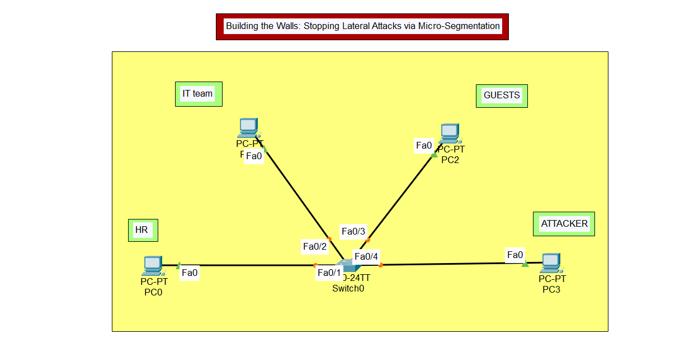
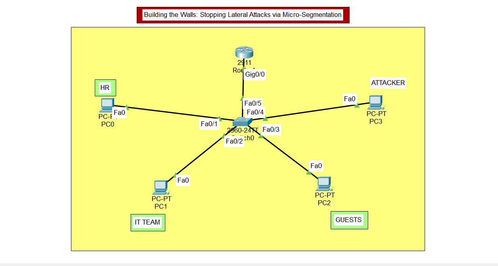
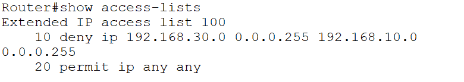
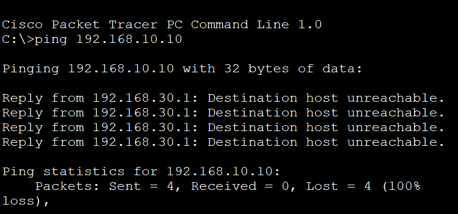
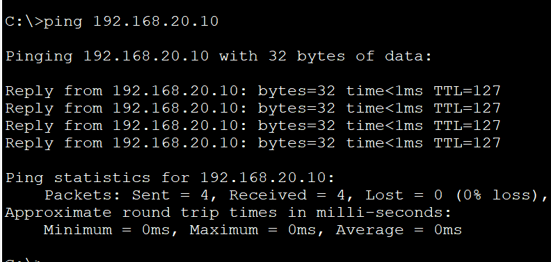

<div align="center">

# 🔒 VLAN Network Segmentation with ACL-Based Access Control

[](https://git.io/typing-svg)


</div>

---

## 📌 Objective

> Flat, unsegmented networks let any compromised device freely reach every other device — including sensitive HR and IT systems.

This project demonstrates how **VLAN segmentation combined with Access Control Lists (ACLs)** can contain a compromised or malicious host, preventing lateral movement to critical resources — while preserving normal business connectivity.

---

## 🖥️ Topology Overview

<div align="center">

| Device | Role | VLAN |
|:------:|:----:|:----:|
| 🖥️ PC0 | HR | `VLAN 10` TRUSTED |
| 🖥️ PC1 | IT Team | `VLAN 10` TRUSTED |
| 🖥️ PC2 | Guests | `VLAN 20` GUESTS |
| 🕵️ PC3 | Simulated Attacker | `VLAN 30` ATTACKER_ZONE |
| 🔀 Switch0 | Layer 2, VLAN-aware trunking | — |
| 🌐 Router 2911 | Inter-VLAN routing (Router-on-a-Stick) | — |

</div>

<details>
<summary>🔽 <b>Click to see: Before vs After Segmentation</b></summary>
<br>

**Before Segmentation:** All 4 devices sit on a single flat network — any device can reach any other device, including HR and IT systems.

**After Segmentation:** Devices are separated into 3 VLANs, with inter-VLAN routing handled by a Router-on-a-Stick configuration and traffic explicitly controlled via ACL.

</details>

---

## ⚙️ Configuration Summary

<details open>
<summary><b>🔧 VLAN Setup</b></summary>

```
VLAN 10  →  TRUSTED       (HR + IT)
VLAN 20  →  GUESTS
VLAN 30  →  ATTACKER_ZONE
```
</details>

<details>
<summary><b>🌐 Router-on-a-Stick (Inter-VLAN Routing)</b></summary>

```
Gi0/0.10  →  VLAN 10 gateway
Gi0/0.20  →  VLAN 20 gateway
Gi0/0.30  →  VLAN 30 gateway
```
</details>

<details>
<summary><b>🛡️ Extended ACL 100 — Access Control Logic</b></summary>

```bash
deny ip 192.168.30.0 0.0.0.255 192.168.10.0 0.0.0.255
permit ip any any
```

This denies any traffic originating from **VLAN 30 (Attacker Zone)** destined for **VLAN 10 (Trusted/HR+IT)**, while permitting everything else — including Guest traffic, which remains unaffected.
</details>

---

## ✅ Test Results

<div align="center">

| Test | Result | Outcome |
|:----:|:------:|:-------:|
| 🕵️ Attacker → HR/IT | `100% packet loss` | 🔴 **BLOCKED** |
| 🕵️ Attacker → Guests | `0% packet loss` | 🟢 **UNAFFECTED** |

</div>

> 💡 This confirms the ACL successfully isolates the attacker zone from trusted resources **without breaking legitimate guest network functionality** — targeted segmentation, not a blanket lockdown.

---

## 📸 Visual Walkthrough

<details>
<summary>🖼️ <b>Click to expand all screenshots</b></summary>
<br>

**Before Segmentation — Flat Network**


**After Segmentation — VLAN + ACL Topology**


**ACL Configuration**


**Ping Test: Attacker → HR/IT (Blocked)**


**Ping Test: Attacker → Guests (Successful)**


</details>

---

## 🧠 Key Learnings

- 🔑 VLANs alone don't provide security — **routing + ACLs are what actually enforce access control** between segments
- 🔑 Practical implementation of Router-on-a-Stick for scalable inter-VLAN routing without a dedicated interface per VLAN
- 🔑 How to write and apply extended ACLs with precise source/destination targeting
- 🔑 The importance of testing **both** the "should be blocked" and "should still work" cases

---

## 🛠️ Tools Used

<div align="center">


</div>

---

## 📂 Repository Structure

```
📦 vlan-network-segmentation-acl
 ┣ 📄 Before_Segmentation.pkt   → Flat network (no VLANs)
 ┣ 📄 After_Segmentation.pkt    → Segmented network + ACL applied
 ┣ 🖼️ topology-before.png
 ┣ 🖼️ topology-after.png
 ┣ 🖼️ acl-config.png
 ┣ 🖼️ ping-test-attacker-to-hr.png
 ┗ 🖼️ ping-test-attacker-to-guests.png
```

<div align="center">

---

⭐ **If this helped you understand VLAN segmentation, consider starring the repo!** ⭐

</div>
